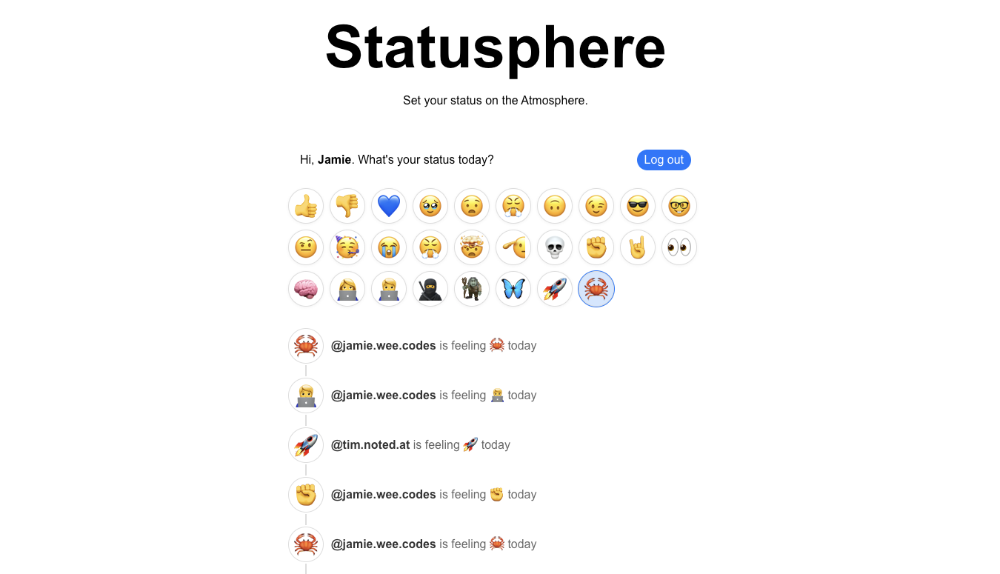

# statusphere-example-rs

An implementation of the [example statusphere app](https://github.com/bluesky-social/statusphere-example-app)
written in Rust, using:

* [`axum`](https://github.com/tokio-rs/axum) web application framework
* [`atrium`](https://github.com/atrium-rs/atrium) ATProto libraries
* [`sqlx`](https://github.com/launchbadge/sqlx) SQLite database interface
* [`minijinja`](https://github.com/mitsuhiko/minijinja) templating engine

It also uses my [ATProto Jetstream consumer library](https://github.com/jblondin/atproto-jetstream) to read status events off the ATProto Jetstream.

This was mainly written as an exercise so I could familiarize myself with ATProto while using the Rust ecosystem I'm familiar with. 

If you're looking for tutorial for how to write your own Statusphere app using Rust, see [Bailey Townsend's Rusty Statusphere](https://github.com/fatfingers23/rusty_statusphere_example_app).